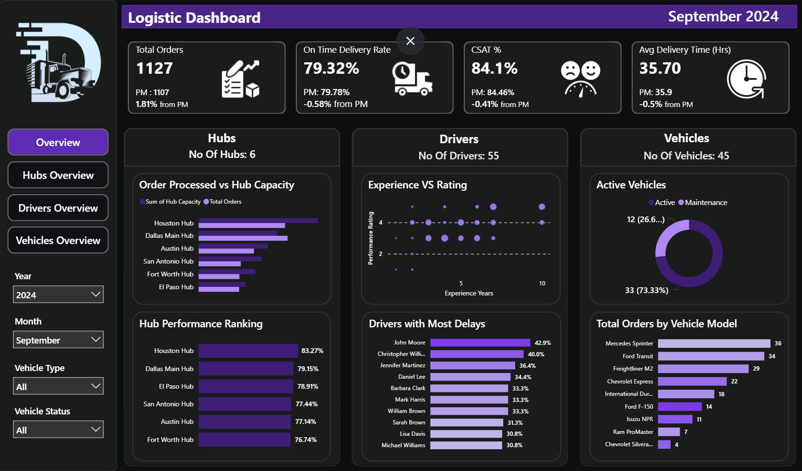
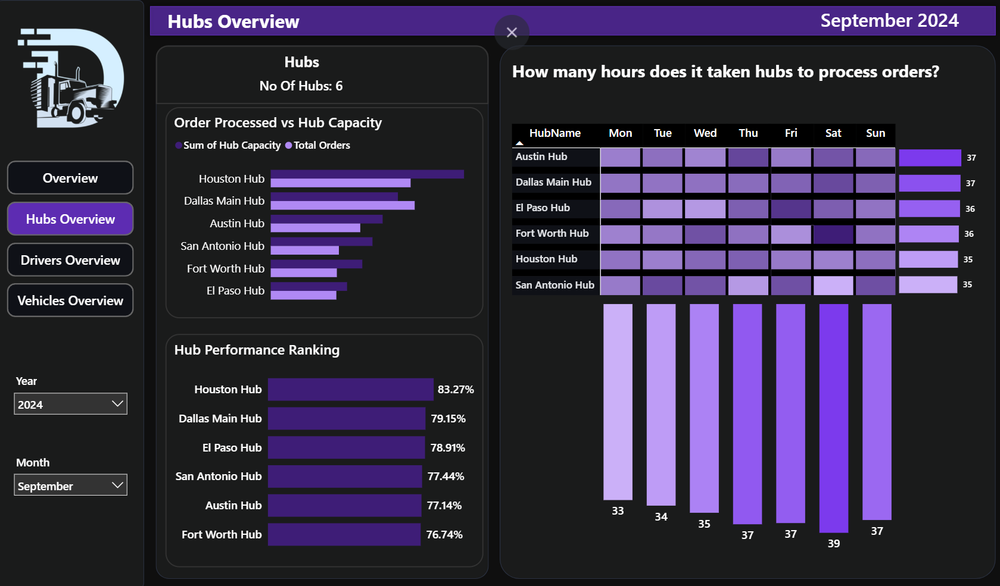
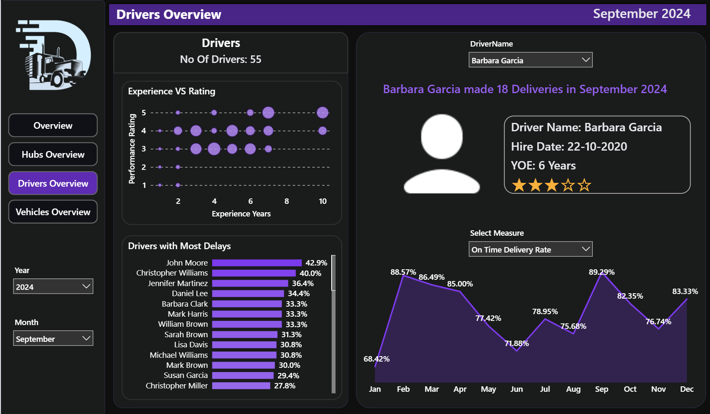
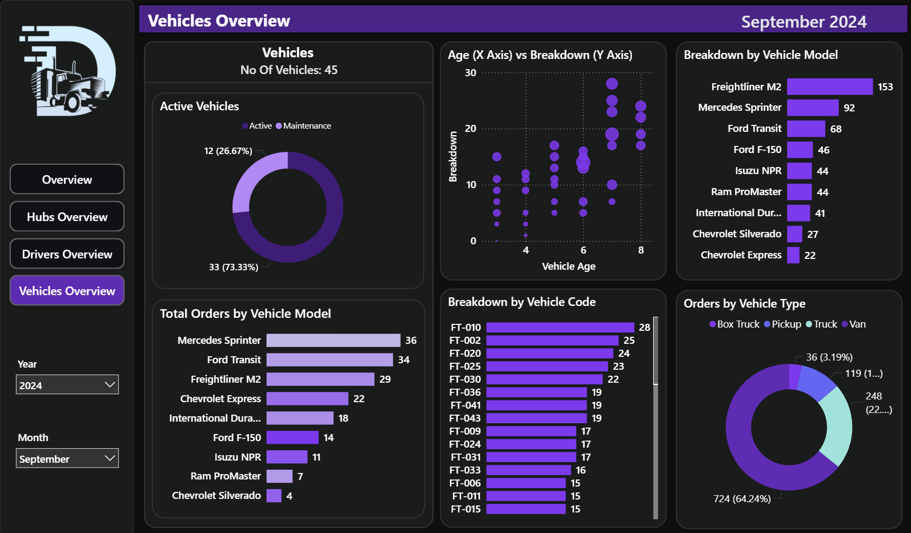

# 🚚 Logistics Operations Analytics Dashboard (Power BI)

## 📊 Project Overview

This project is an end-to-end Business Intelligence solution built using Microsoft Power BI to analyze logistics operations. The dashboard provides insights into delivery performance, hub efficiency, driver productivity, and fleet utilization.

The goal is to transform raw logistics data into actionable insights that help operations teams improve delivery performance, reduce delays, and enhance customer satisfaction.

This project simulates a real-world logistics analytics scenario used by operations managers and decision makers.

---

# 🎯 Business Problem

Logistics companies manage thousands of deliveries across multiple hubs, drivers, and vehicles. Without centralized analytics it becomes difficult to:

- Track delivery performance
- Identify delays
- Monitor hub capacity
- Evaluate driver performance
- Manage vehicle reliability
- Understand customer satisfaction trends

As data grows, manual monitoring becomes inefficient and decision-making slows down.

This dashboard provides a single analytics platform to monitor and optimize logistics operations.

---

# 🧠 Key Business Questions

This dashboard answers critical operational questions:

- How many orders are delivered each month?
- Are deliveries happening on time?
- Which hubs are overloaded?
- Which drivers are underperforming?
- Which vehicles are causing delays?
- How satisfied are customers?

---

# 🗂 Dataset Description

The project uses multiple relational datasets representing the logistics ecosystem.

## Orders

Transactional dataset containing delivery activity.

**Key columns:**

- Order ID  
- Order Date  
- Actual Delivery Date  
- Delivery Time (hours)  
- Driver  
- Hub  
- Vehicle  
- Order Status  
- Delay Reason  
- Customer Satisfaction Score  
- Hub Processing Time  

**Insights derived:**

- Delivery efficiency  
- Delay analysis  
- Customer experience  
- Operational performance  

---

## Hubs

Distribution centers where orders are processed.

**Fields:**

- Hub ID  
- Hub Name  
- Hub Capacity  

**Used to analyze:**

- Hub utilization  
- Operational workload  
- Bottlenecks  

---

## Drivers

Information about delivery drivers.

**Fields:**

- Driver ID  
- Driver Name  
- Hire Date  
- Experience Years  
- Employment Type  
- Performance Rating  

**Used for:**

- Driver productivity analysis  
- Experience vs performance insights  
- Workforce planning  

---

## Vehicles

Fleet information used for deliveries.

**Fields:**

- Vehicle ID  
- Vehicle Model  
- Purchase Date  
- Breakdown Count  
- Vehicle Status  

**Used to analyze:**

- Fleet reliability  
- Maintenance patterns  
- Vehicle utilization  

---

# 🏗 Data Model

The dashboard follows a **Star Schema design.**

### Fact Table
Orders

### Dimension Tables
- Drivers  
- Hubs  
- Vehicles  
- Date Table  

This model enables efficient filtering and cross-analysis across logistics operations.

**Example analysis:**

- Orders by hub  
- Orders by vehicle  
- Driver performance  
- Delay patterns  
- Customer satisfaction trends  

---

# 📅 Date Table (Time Intelligence)

A custom date table enables accurate time-based analysis.

```DAX
Date Table =
CALENDAR(
    MIN(Orders[Order Date]),
    MAX(Orders[Order Date])
)
```

**Additional columns:**

```DAX
Month = FORMAT('Date Table'[Date], "mmmm")

Month No = MONTH('Date Table'[Date])

Year = YEAR('Date Table'[Date])

Day = FORMAT('Date Table'[Date], "ddd")
```

**Used for:**

- Monthly reporting  
- Trend analysis  
- MoM comparisons  

---

# 📈 Key Metrics & DAX Calculations

## Total Orders

```DAX
Total Orders =
COUNT(Orders[Order ID])
```

## Previous Month Orders

```DAX
PM Orders =
CALCULATE(
    [Total Orders],
    DATEADD('Date Table'[Date], -1, MONTH)
)
```

## Month-over-Month Growth

```DAX
MoM Orders % =
DIVIDE(
    [Total Orders] - [PM Orders],
    [PM Orders]
)
```

---

# On-Time Delivery Metrics

```DAX
Delivered Orders =
CALCULATE(
    [Total Orders],
    Orders[Order Status] = "Delivered"
)
```

```DAX
On Time Delivered Orders =
CALCULATE(
    [Total Orders],
    Orders[Order Status] = "Delivered",
    Orders[Is On Time] = TRUE()
)
```

```DAX
On Time Delivery Rate =
DIVIDE(
    [On Time Delivered Orders],
    [Delivered Orders]
)
```

---

# Customer Satisfaction (CSAT)

Orders with rating ≥ 4 are considered satisfied.

```DAX
CSAT Satisfied Orders =
CALCULATE(
    [Total Orders],
    Orders[Customer Satisfaction Score] >= 4
)
```

```DAX
CSAT % =
DIVIDE(
    [CSAT Satisfied Orders],
    [Total Orders]
)
```

```DAX
PM CSAT =
CALCULATE(
    [CSAT %],
    DATEADD('Date Table'[Date], -1, MONTH)
)
```

```DAX
MoM CSAT % =
DIVIDE(
    [CSAT %] - [PM CSAT],
    [PM CSAT]
)
```

---

# 🚛 Driver Insights

Dynamic driver performance titles:

```DAX
Drivers Title =
SELECTEDVALUE(Drivers[DriverName])
& " made "
& [Total Orders]
& " Deliveries in "
& SELECTEDVALUE('Date Table'[Month])
& " "
& SELECTEDVALUE('Date Table'[Year])
```

Driver star rating visualization:

```DAX
Star Rating =
REPT(UNICHAR(9733), AVERAGE(Drivers[Performance Rating]))
&
REPT(UNICHAR(9734), 5 - AVERAGE(Drivers[Performance Rating]))
```

---

# 🚚 Fleet Analysis

Vehicle age calculation:

```DAX
Vehicle Age =
DATEDIFF(
    Vehicles[Purchase Date],
    TODAY(),
    YEAR
)
```

Used to identify:

- Aging vehicles  
- Maintenance risks  
- Replacement planning  

---

# 📊 Dashboard Pages

## Executive Overview

High-level summary of logistics performance.

**KPIs:**

- Total Orders  
- On-Time Delivery Rate  
- Customer Satisfaction  
- Average Delivery Time  

Includes month-over-month comparison to track performance trends.

---

## Hub Performance

**Insights:**

- Orders vs hub capacity  
- Hub ranking  
- Processing time analysis  

Helps detect:

- Bottlenecks  
- Overloaded hubs  
- Underutilized infrastructure  

---

## Driver Performance

Analytics include:

- Experience vs rating  
- Drivers causing delays  
- Monthly delivery trends  
- Individual driver profiles  

Used for workforce optimization.

---

## Vehicles Performance

Insights include:

- Active vs inactive vehicles  
- Orders by vehicle model  
- Vehicle age vs breakdown  
- Breakdown frequency  
- Fleet utilization patterns  

Supports fleet management and maintenance planning.

---

# 💡 Key Insights Generated

The dashboard helps identify:

- Delivery delays and root causes  
- Underperforming hubs  
- High-risk vehicles  
- Driver performance gaps  
- Customer satisfaction trends  
- Seasonal demand patterns  

These insights enable data-driven logistics decisions.

---

# 🛠 Tools & Technologies

- Microsoft Power BI  
- Power Query  
- DAX  
- Data Modeling  
- Data Visualization  

---

# 🧩 Skills Demonstrated

- Data Cleaning  
- Data Modeling  
- DAX Calculations  
- Time Intelligence  
- KPI Development  
- Dashboard Design  
- Business Analysis  
- Data Storytelling  

---

# 📁 Repository Structure

```
Logistics-PowerBI-Dashboard
│
├── Dashboard
│   └── Logistic Dashboard.pbix
│
├── Data
│   ├── Orders.csv
│   ├── Drivers.csv
│   ├── Hubs.csv
│   └── Vehicles.csv
│
├── Screenshots
│   ├── overview.png
│   ├── hub-performance.png
│   ├── driver-performance.png
│   └── Vehicles-performance.png
│
└── README.md
```

---

# ▶️ How to Use

- Download or clone the repository  
- Open the .pbix file using Power BI Desktop  
- Refresh the dataset if required  
- Explore the dashboard using filters and slicers  

---

# 📸 Dashboard Screenshots

## Overview


## Hub Performance


## Driver Performance


## Vehicles Performance


---

# 👤 Author

Mithun Adhe  
Data Analyst | Power BI Developer  

LinkedIn: www.linkedin.com/in/mithun-adhe
